# Comparison: original PNG, iteration 1, iteration 2

Branch: `documents-improved`. Nothing is committed. No doc link changes.

| Iteration | Files | Rule |
| --- | --- | --- |
| 1 | `doc/png/<name>_v1.svg` .. `_v3.svg` | The style of `arch.svg`. Some versions changed the layout. |
| 2 | `doc/png/<name>_v4.svg` .. `_v6.svg` | The flow and layout of the original PNG, with the `doc/colors.md` palette, thick lines and big text. |
| 3 | `<dir>/<name>_v1.svg` .. `_v3.svg`, next to each original SVG diagram | The style of iteration 2, applied to the old draw.io SVG diagrams. `doc/png/arch.svg` does not change. |

## Iteration 3: the SVG diagrams

These are the 5 SVG diagrams in the repository, without `arch.svg` (it stays as it
is) and without the two Intel logo files in `ecosystem/` (they are not diagrams).
Each one has 3 proposals, made by one subagent for each diagram. The rules are the
same as for iteration 2: the original layout and flow, only the `doc/colors.md`
palette, 3 px outlines, arrows of 4 to 5 px, and text of 18 px or larger. Each file
passes the palette and XML checks, and I compared each one with its original.

| Proposal | Rule |
| --- | --- |
| `_v1` | Closest to the original. Diagram only. |
| `_v2` | `_v1` plus a key-points panel in big text, from the doc around the image. |
| `_v3` | `_v1` plus numbered steps, a legend, and the main path emphasized. |

| Diagram | Used in | Agent pick | Why |
| --- | --- | --- | --- |
| `doc/png/af_xdp.svg` | `doc/xdp.md:22` | v3 | It adds the driver half of each ring loop as dashed arrows, so the TX and RX cycles close. |
| `doc/png/xdp-mtl.svg` | `doc/xdp.md:34` | v3 | It shows what the filter does: a listed UDP port goes to the socket, all other packets go to the stack. |
| `doc/png/rtcp.svg` | `doc/rtcp.md:18` | v3 | Steps 1 to 6: lost, gap found, NACK, sent again, oldest dropped. |
| `manager/manager_design.svg` | `manager/README.md:5` | v3 | Steps 1 to 7 give the order: listen, connect, recv, load, add, port, datapath. |
| `.github/ci_arch.svg` | `.github/github_actions_issue.md:19` | v3 | Steps 1 to 13, the main path in blue, one download trunk. |

### Items to check in iteration 3

1. **Map name.** The code calls the port filter map `udp4_dp_filter`
   (`manager/mtl.xdp.c:20`), not `udp_filter_map`. Only `xdp-mtl_v3` uses the code
   name. `xdp-mtl_v1`, `_v2`, and all three `manager_design` versions keep the old
   name. Use the same name in both diagrams.
2. **`af_xdp`.** The kernel `struct xdp_desc` holds `addr, len, options`, not
   `index`, and the Fill and Completion rings hold only addresses. All three
   versions keep "index, addr, len" from the original. The 2048 B frame size is a
   typical value: MTL takes the UMEM frame size from the mempool.
3. **`rtcp`.** I found no code in `lib/src/mt_rtcp.c` that sends the dashed "RTCP
   packet" from TX to RX; the code handles only the NACK from RX. All three
   versions keep it from the original. The window values 128 and 10 come from the
   original; the doc example uses `seq_bitmap_size = 64` (512 packets) and
   `seq_skip_window = 4`.
4. **`manager_design`.** "crush" is now "crash". `manager_design_v3` draws the port
   filter arrow dashed, "through the manager": the instance sends
   `ADD_UDP_DP_FILTER` or `DEL_UDP_DP_FILTER`, and the manager writes the map.
5. **`ci_arch`.**
   - "MD5SUM" is now "SHA-256" in all three versions. `script/hash_sources.sh` uses
     `sha256sum`.
   - The dotted lines from the stash to the hosts now say "Download", not "UPLOAD".
   - "RAPORT" is now "Report", and "CREATE REL CANDIDATE" is now "Create release
     candidate".
   - "ANDRZEJOS -- JPEGA" stays in v1. v2 and v3 say "JPEG-XS (owner check)". Tell
     me the right label.
   - "Validate build" still says that it builds the ICE driver if needed, which is
     today's behavior. `.github/github_actions_issue.md` proposes to stop that.

### Iteration 3 side by side

<table>
<tr><th>af_xdp: original</th><th>v1</th><th>v2</th><th>v3</th></tr>
<tr><td>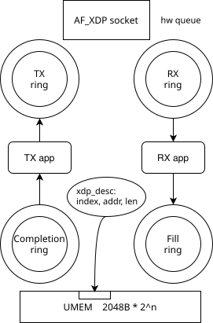</td><td></td><td></td><td>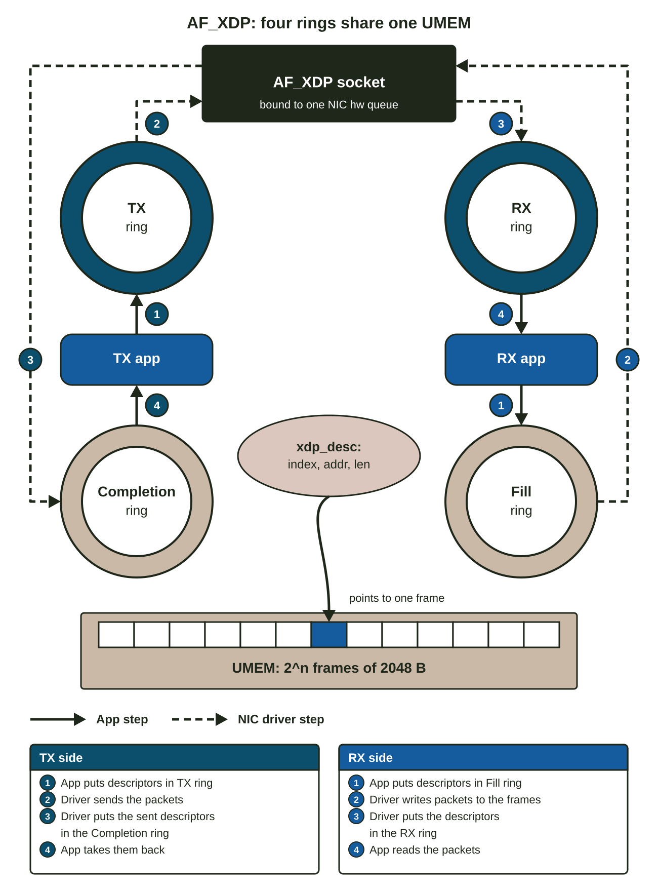</td></tr>
</table>
<table>
<tr><th>xdp-mtl: original</th><th>v1</th></tr>
<tr><td>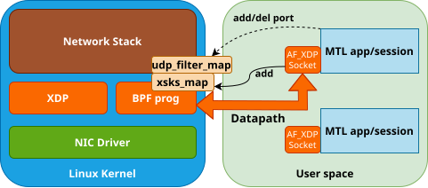</td><td>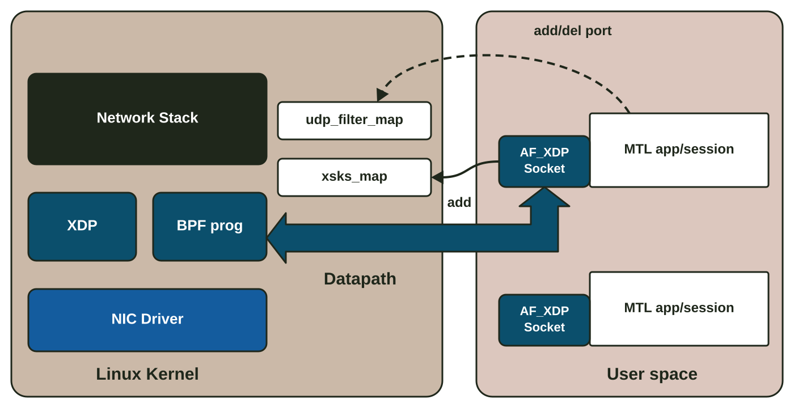</td></tr>
<tr><th>v2</th><th>v3</th></tr>
<tr><td></td><td></td></tr>
</table>
<table>
<tr><th>rtcp: original</th><th>v1</th></tr>
<tr><td>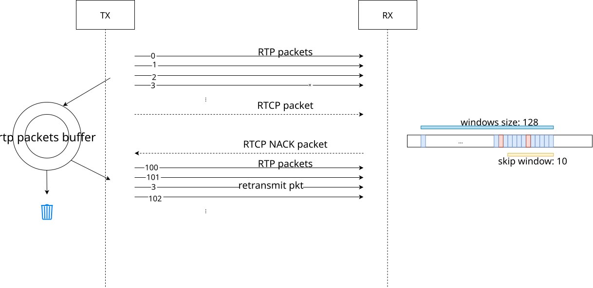</td><td>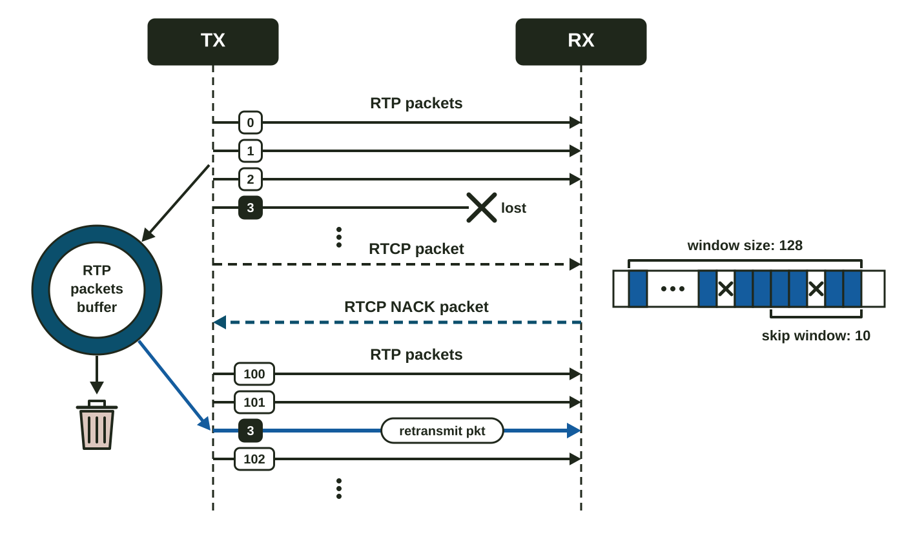</td></tr>
<tr><th>v2</th><th>v3</th></tr>
<tr><td></td><td></td></tr>
</table>
<table>
<tr><th>manager_design: original</th><th>v1</th></tr>
<tr><td>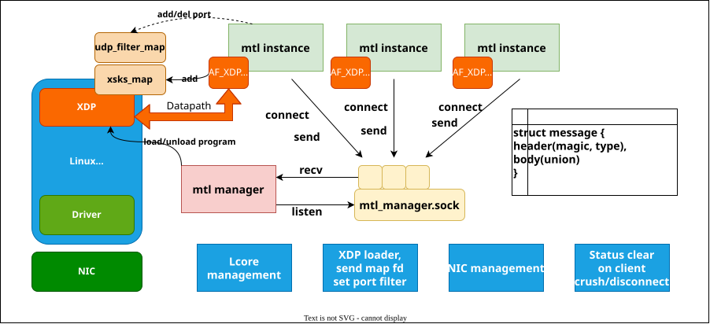</td><td>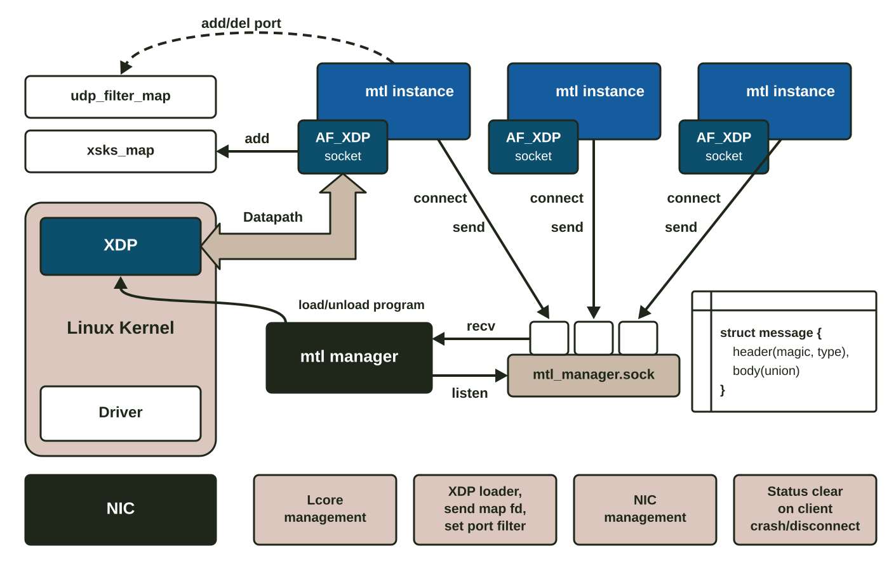</td></tr>
<tr><th>v2</th><th>v3</th></tr>
<tr><td></td><td></td></tr>
</table>
<table>
<tr><th>ci_arch: original</th><th>v1</th></tr>
<tr><td></td><td></td></tr>
<tr><th>v2</th><th>v3</th></tr>
<tr><td></td><td></td></tr>
</table>

To change an iteration 3 diagram, edit `/home/labrat/svg_gen/i3_<module>.py`
(modules: `af_xdp`, `xdp_mtl`, `rtcp`, `manager_design`, `ci_arch`) and run
`/tmp/svgvenv/bin/python build3.py <module>` in `/home/labrat/svg_gen`.

## What changed in iteration 2

- **The original flow stays.** Each image keeps the arrangement of its PNG, as
  `tasklet_v1` did in iteration 1: the same boxes in the same places, and the same
  arrows. Iteration 2 makes no new layouts.
- **Only the `doc/colors.md` palette**, plus white: `#1F271B` ink, `#0B4F6C` teal,
  `#145C9E` blue, `#CBB9A8` tan, `#DCC7BE` sand. `build2.py` rejects any other
  color, and each of the 33 files passes that check.
- **Thick lines and big text.** Box outlines are 3 px, arrows are 4 to 5 px with
  heads of 18 px or more, the smallest text is 18 px, and names are 20 to 24 px bold.
- **One subagent for each image** (11 in total). Each one compared its previews with
  the original PNG and fixed overlaps and overflows. I then checked all 33 files
  side by side with the originals.

### The three versions of iteration 2

| Version | Rule |
| --- | --- |
| `_v4` | Closest to the original. Only the diagram; the slide title and bullets are not in it. |
| `_v5` | `_v4` plus the slide bullets in big text, where the slide had them. It reads like the original slide. |
| `_v6` | `_v4` plus aids that make it clearer: numbered steps, a legend, emphasis. It is still the same picture. |

## Recommended picks

"Agent" is the pick of the subagent that drew the image. "Mine" is my pick for the
doc page, where the text around the image already explains the bullets.

| Image | Agent | Mine | Why |
| --- | --- | --- | --- |
| `software_stack` | v4 | **v4** | `design.md` section 1 already has the text. v6 adds T1-T4 and R1-R4 numbers for new readers. |
| `tasklet` | v5 | **v4** | The ring that you liked, larger. Use v6 for the note that KNI is gone. |
| `tx_pacing` | v5 | **v4** | Sections 4.3.2 and 4.3.3 of `design.md` explain the methods. v6 adds the `--pacing_way` rule. |
| `tx_zero_copy` | v6 | **v6** | The matching fills show which header goes with which slice. |
| `rx_dma_offload` | v6 | **v6** | The numbered steps show what moves. Use v5 to keep the CPU vs DSA chart. |
| `mtl-appliance-use-case` | v6 | **v6** | Steps 1 to 4 and a cable legend. |
| `desktop-streaming-mtl` | v6 | **v6** | It matches `mtl-appliance-use-case_v6`. |
| `instance` | v6 | **v6** | Each callout points to its field. "Make 2 instances" stands out. |
| `netuio` | v6 | **v6** | Call-outs 1 to 4 make it a check for the reader. |
| `virt2phy` | v6 | **v6** | It matches `netuio_v6`. |
| `yuview_yuv422rfc4175be10_layout` | v6 | **v6** | The 6 values to set are marked. v5 adds the pgroup byte layout. |

## Items to check

1. **`tasklet_v6`** keeps the original tasklet names. It adds a note: the code has
   no KNI tasklet, and one `cni` tasklet (`lib/src/mt_cni.c`) does ARP and IGMP.
2. **`tx_pacing_v5` and `_v6`** replace "Available in next generation intel NIC"
   with the text of `design.md` 4.3.3: Intel E830, a PF port, the built-in PTP; E810
   has no support. The "Auto: RL if the NIC supports it, else TSC" box in v6 agrees
   with `lib/src/dev/mt_dev.c:1489`: RL when the driver has TM rate limiting, else
   TSC.
3. **`software_stack_v6`** leaves out the two dotted lines beside the
   ARP/IGMP/PTP tasklet, so the picture has less clutter. v4 and v5 keep them.
4. **`rx_dma_offload_v6`** says "Header: the CPU reads it, the DMA engine skips it".
   The slide does not say this. It agrees with the RX path: the tasklet parses the
   header and sends only the payload to the DMA engine.
5. **`netuio`**: the highlight on the first E810-C port is new. The screenshot
   selects no row.
6. **`virt2phy_v6`** has the caption "virt2phys gives DPDK the physical address of
   user memory". That is a summary of the driver's role, not text from the docs. The
   `bcdedit.exe /set testsigning on` step in v5 comes from `doc/run_WIN.md:20`.
7. **`yuview_yuv422rfc4175be10_layout_v5`**: the note "0: no chroma position shift"
   for the two Chroma Offset fields is new wording.
8. **`doc/sdm_appliance.md` does not agree with its own pictures.** The pictures
   show 192.168.100.32 and .30. The example commands use `-local_addr
   192.168.100.55` on both hosts. The new SVGs keep the addresses of the pictures.
   Fix the doc.
9. **`mtl-appliance-use-case`** writes the stream label on two lines, because the
   laptop takes width. `desktop-streaming-mtl` writes it on one line. The rest of
   the two pictures is the same.
10. **Typos corrected** in iteration 2: asynchronized, Eesy, TR_OFFEST, encapulation,
    de-capulation, SPEDUP, Taskslet, ChromaOffset Y, ip:/Ip:, NUC11TNki5.

## Side by side

Each block shows the original, my iteration 1 pick from `review.md`, and the three
iteration 2 versions. Open this file in a Markdown preview to see the images.

### software_stack

<table>
<tr><th>Original</th><th>Iteration 1 pick (v3)</th></tr>
<tr><td>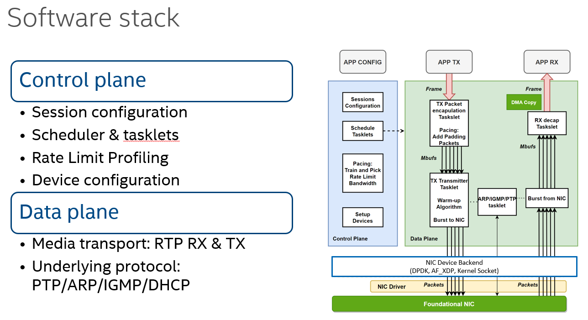</td><td></td></tr>
</table>
<table>
<tr><th>v4</th><th>v5</th><th>v6</th></tr>
<tr><td></td><td></td><td></td></tr>
</table>

### tasklet

<table>
<tr><th>Original</th><th>Iteration 1 (v1, the one you liked)</th></tr>
<tr><td>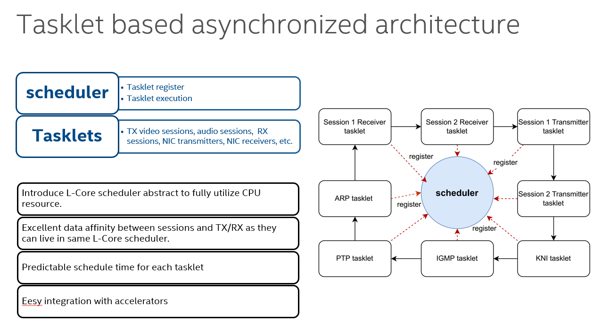</td><td></td></tr>
</table>
<table>
<tr><th>v4</th><th>v5</th><th>v6</th></tr>
<tr><td></td><td></td><td>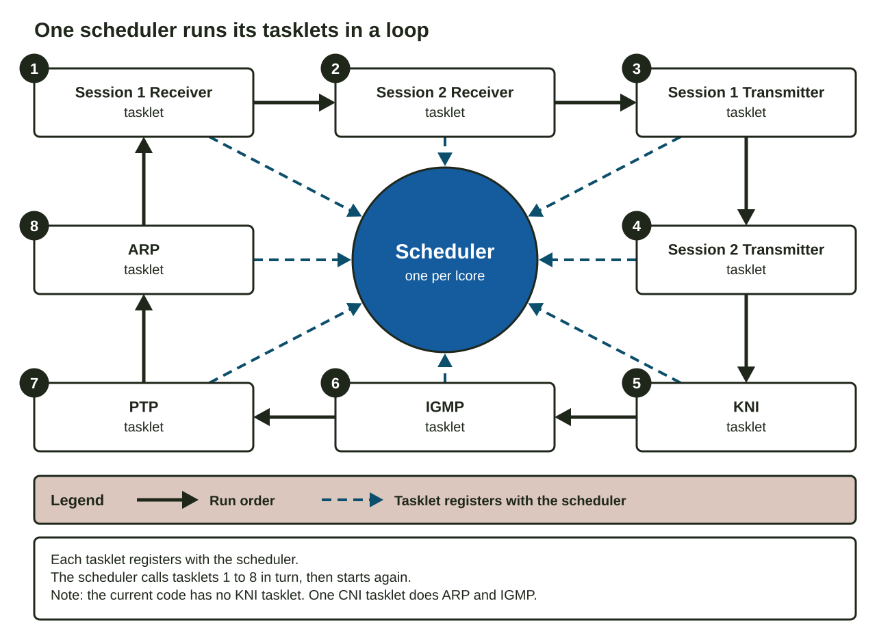</td></tr>
</table>

### tx_pacing

<table>
<tr><th>Original</th><th>Iteration 1 pick (v3)</th></tr>
<tr><td>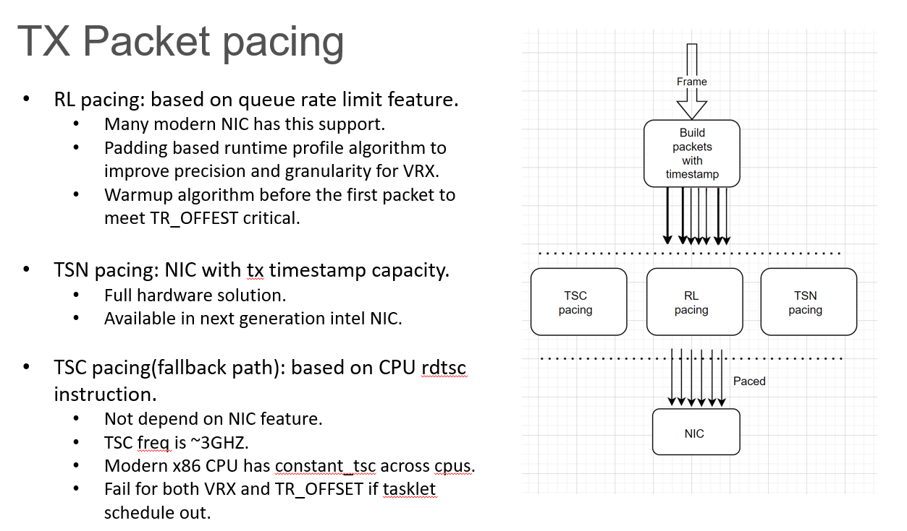</td><td></td></tr>
</table>
<table>
<tr><th>v4</th><th>v5</th><th>v6</th></tr>
<tr><td></td><td></td><td></td></tr>
</table>

### tx_zero_copy

<table>
<tr><th>Original</th><th>Iteration 1 pick (v3)</th></tr>
<tr><td>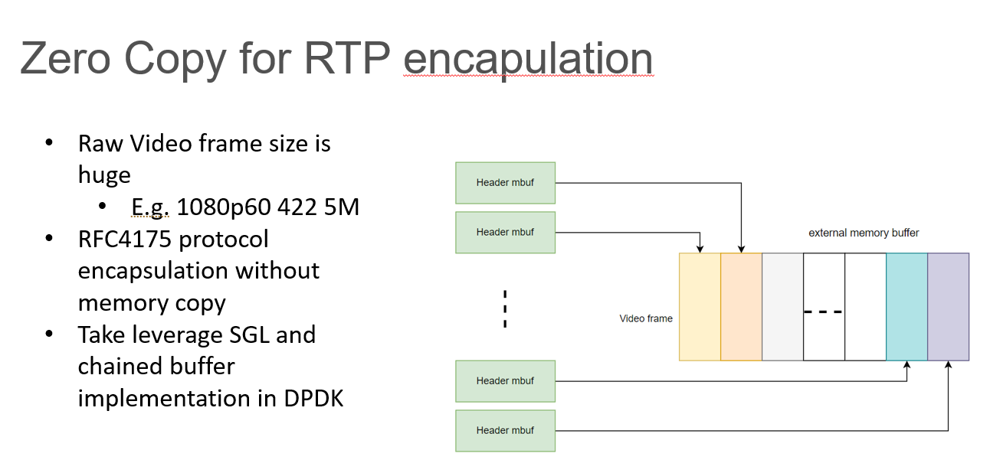</td><td></td></tr>
</table>
<table>
<tr><th>v4</th><th>v5</th><th>v6</th></tr>
<tr><td></td><td>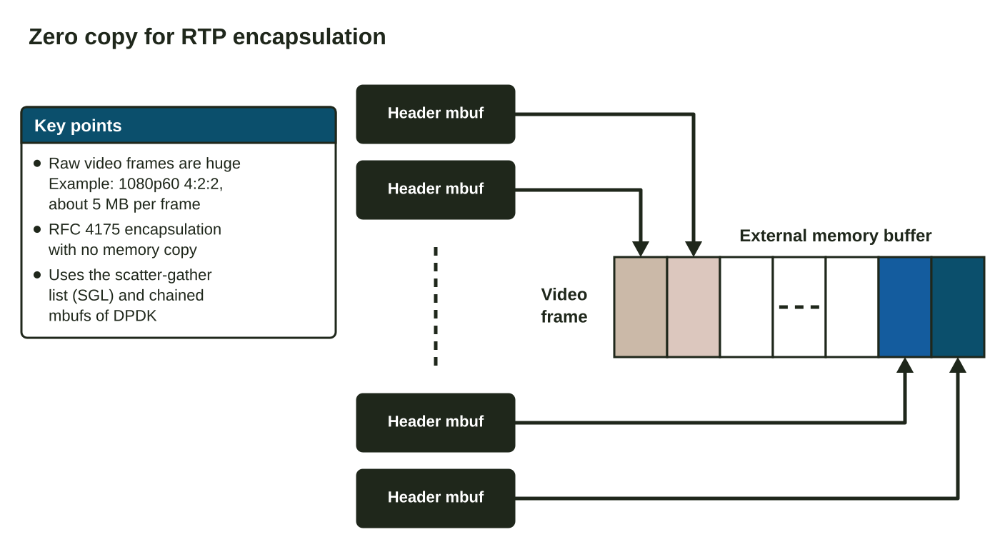</td><td></td></tr>
</table>

### rx_dma_offload

<table>
<tr><th>Original</th><th>Iteration 1 pick (v2)</th></tr>
<tr><td>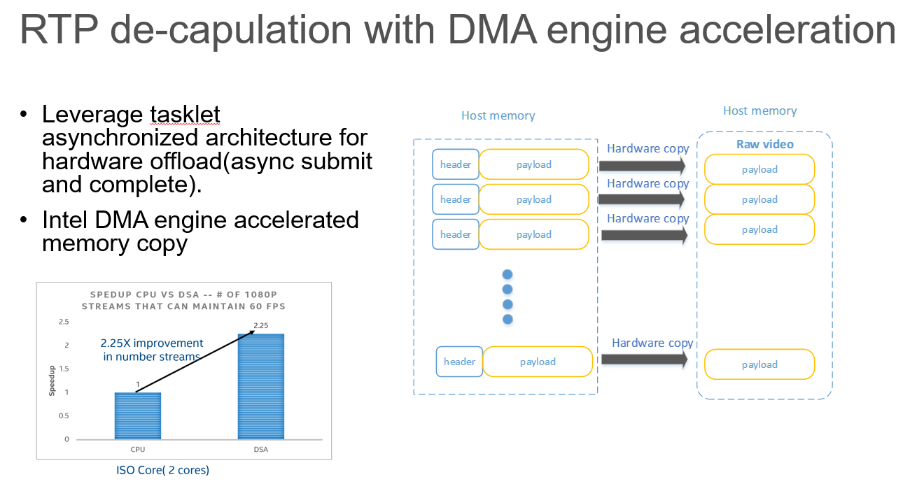</td><td></td></tr>
</table>
<table>
<tr><th>v4</th><th>v5</th><th>v6</th></tr>
<tr><td></td><td></td><td></td></tr>
</table>

### mtl-appliance-use-case

<table>
<tr><th>Original</th><th>Iteration 1 pick (v1)</th></tr>
<tr><td>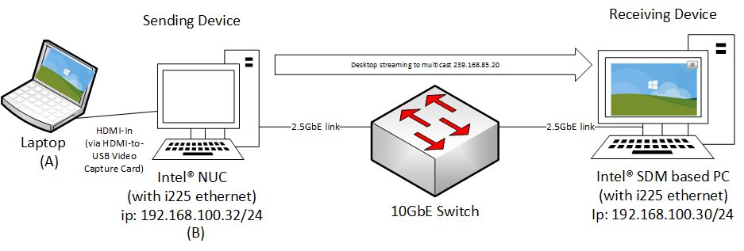</td><td></td></tr>
</table>
<table>
<tr><th>v4</th><th>v5</th><th>v6</th></tr>
<tr><td></td><td></td><td></td></tr>
</table>

### desktop-streaming-mtl

<table>
<tr><th>Original</th><th>Iteration 1 pick (v1)</th></tr>
<tr><td>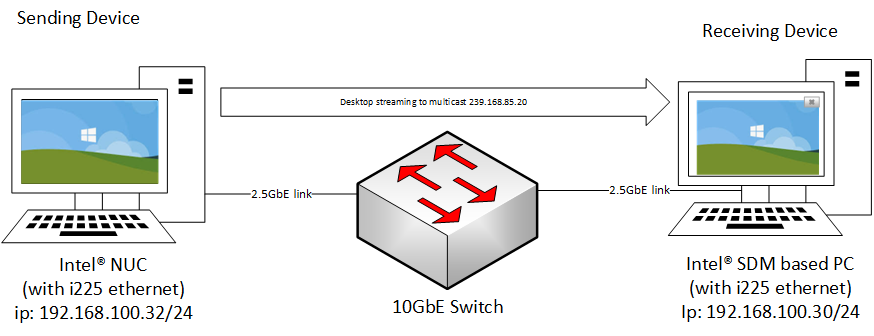</td><td></td></tr>
</table>
<table>
<tr><th>v4</th><th>v5</th><th>v6</th></tr>
<tr><td></td><td>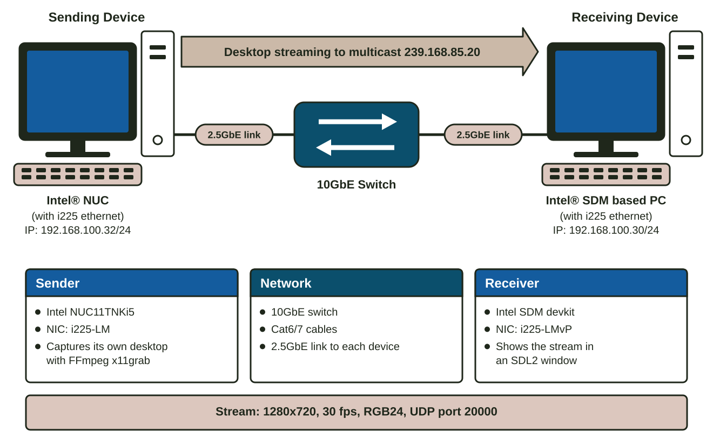</td><td>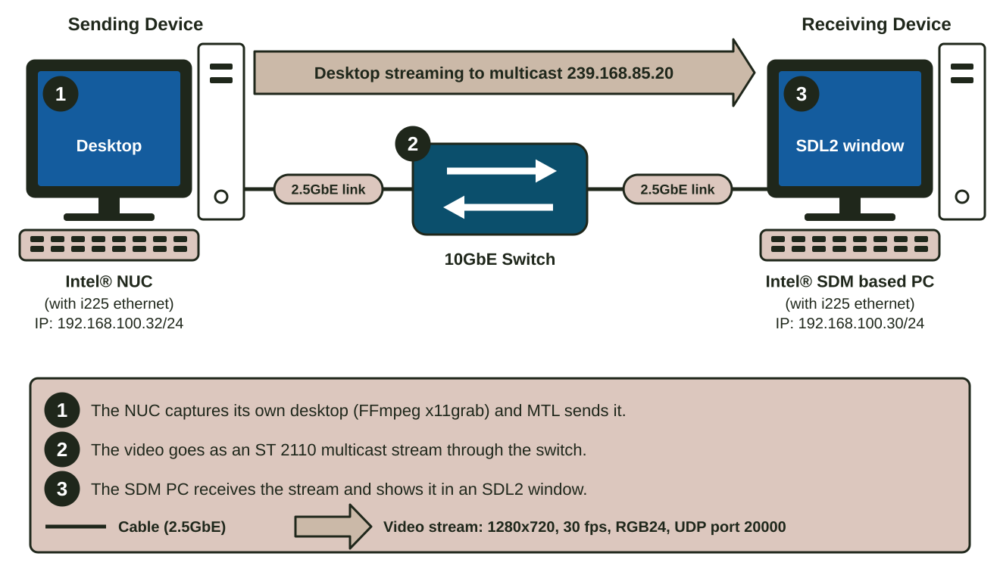</td></tr>
</table>

### instance

<table>
<tr><th>Original</th><th>Iteration 1 pick (v2)</th></tr>
<tr><td>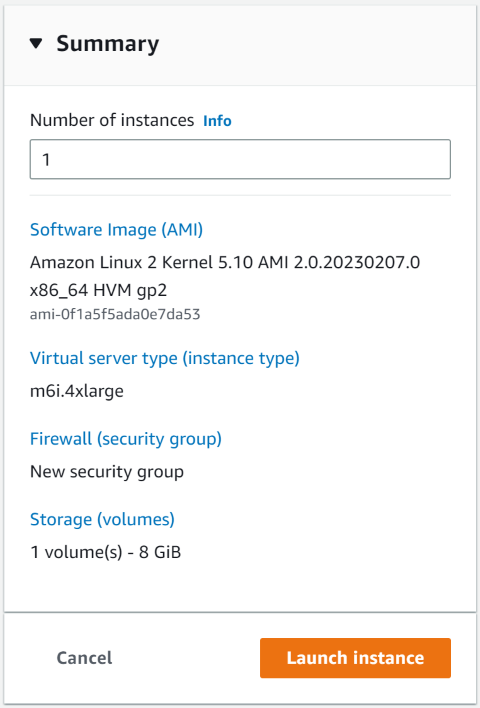</td><td></td></tr>
</table>
<table>
<tr><th>v4</th><th>v5</th><th>v6</th></tr>
<tr><td></td><td></td><td></td></tr>
</table>

### netuio

<table>
<tr><th>Original</th><th>Iteration 1 pick (v2)</th></tr>
<tr><td>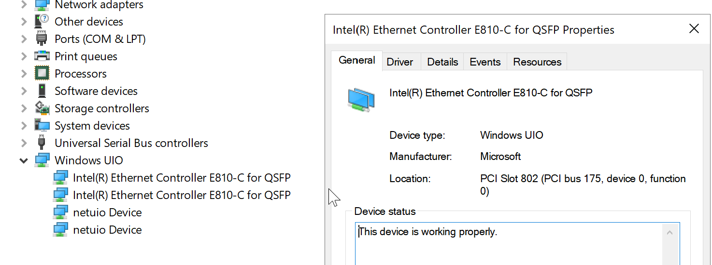</td><td></td></tr>
</table>
<table>
<tr><th>v4</th><th>v5</th><th>v6</th></tr>
<tr><td></td><td></td><td></td></tr>
</table>

### virt2phy

<table>
<tr><th>Original</th><th>Iteration 1 pick (v2)</th></tr>
<tr><td>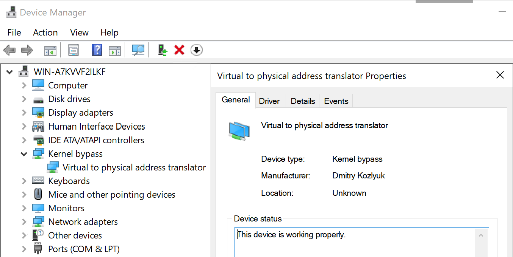</td><td></td></tr>
</table>
<table>
<tr><th>v4</th><th>v5</th><th>v6</th></tr>
<tr><td></td><td></td><td></td></tr>
</table>

### yuview_yuv422rfc4175be10_layout

<table>
<tr><th>Original</th><th>Iteration 1 pick (v1)</th></tr>
<tr><td>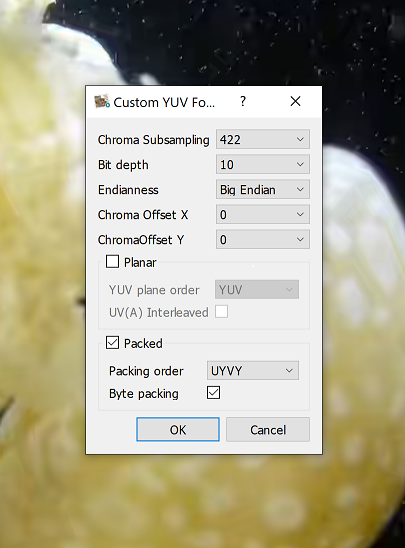</td><td></td></tr>
</table>
<table>
<tr><th>v4</th><th>v5</th><th>v6</th></tr>
<tr><td></td><td></td><td></td></tr>
</table>

## How to change an iteration 2 image

The generators are outside Git, in `/home/labrat/svg_gen/`. `lib2.py` holds the
palette and the thick-line style. Each image has its own `i2_<module>.py`:

| Module | Output name |
| --- | --- |
| `software_stack`, `tasklet`, `tx_pacing`, `tx_zero_copy`, `rx_dma_offload`, `instance`, `netuio`, `virt2phy` | the same name |
| `sdm_sync` | `mtl-appliance-use-case` |
| `sdm_async` | `desktop-streaming-mtl` |
| `yuview` | `yuview_yuv422rfc4175be10_layout` |

```bash
cd /home/labrat/svg_gen
/tmp/svgvenv/bin/python build2.py <module>   # writes doc/png/<name>_v4..v6.svg, previews in /tmp/svg_prev
```

`build2.py` stops with an error when an SVG uses a color outside `doc/colors.md`.

## After you select

1. Rename the version you select to `doc/png/<name>.svg`. Delete the other five.
2. Change the link in the doc from `png/<name>.png` to `png/<name>.svg`. The doc
   file and line of each image are in `review.md`.
3. `git rm` the PNG.
4. Delete `review.md` and `comparison.md`.
5. Commit with `mtl-commit`.
