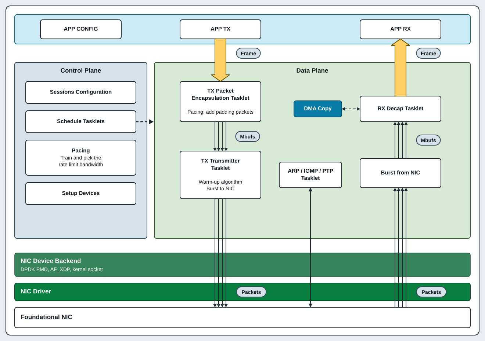
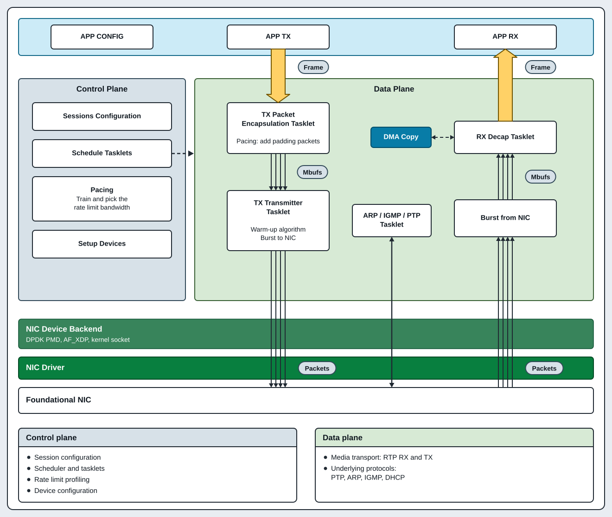

# Review: SVG versions of the doc/PNG images

> **Iteration 2 is in `comparison.md`.** It has the `_v4` to `_v6` files, which
> keep the flow of the original PNG and use the `doc/colors.md` palette. This file
> covers iteration 1 (`_v1` to `_v3`) only.

Branch: `documents-improved`. Nothing is committed yet, and no `.md` file under
`doc/` changes. Each PNG stays in place until you select a version.

## What changed

- 33 new files: `doc/png/<name>_v1.svg`, `_v2.svg`, and `_v3.svg` for each of the
  11 PNG files in `doc/png/`.
- This file, `review.md`. Delete it before you merge.

All the SVG files use the style of `doc/png/arch.svg`: the same colors, the same
font stack, the same 2 px dark outlines, rounded boxes, pill labels, and the white
panel on the `#e9edf2` background. Each file has a `<title>` and a `<desc>` for
screen readers. Each file is valid XML (`xmllint`), and I rendered each one and
looked at it for text overflow and overlap.

### The three versions

| Version | Rule |
| --- | --- |
| `_v1` | The same content and layout as the PNG, redrawn. Only the diagram: the slide title and the bullet text are not in it. Use it as a direct replacement. |
| `_v2` | `_v1` plus the slide bullet text as cards, so the image explains itself. |
| `_v3` | A new layout that shows the idea more clearly. For some images, it also uses the names from the current source code (see "Items to check"). |

For the 4 screenshots (`instance`, `netuio`, `virt2phy`, `yuview`): `_v1` redraws
the screenshot as a clean figure, `_v2` is a settings table or a checklist, and
`_v3` explains what the settings mean.

### Not done

- `doc/png/compliance/*.png` (10 files). These are screenshots of measurements from
  the VERO and Pharbrix analyzers. A redraw would make up data, so I did not make
  versions of them.
- The doc links. When you select a version, change the link in the doc and delete
  the PNG. The table in "Where each image is used" gives the doc file and line.

## Where each image is used

| PNG | Used in |
| --- | --- |
| `software_stack.png` | `doc/design.md:9` |
| `tasklet.png` | `doc/design.md:24` |
| `tx_zero_copy.png` | `doc/design.md:219` |
| `tx_pacing.png` | `doc/design.md:236` |
| `rx_dma_offload.png` | `doc/design.md:255` |
| `instance.png` | `doc/aws.md:15` |
| `mtl-appliance-use-case.png` | `doc/sdm_appliance.md:11` |
| `desktop-streaming-mtl.png` | `doc/sdm_appliance.md:15` |
| `yuview_yuv422rfc4175be10_layout.png` | `doc/run.md:193` |
| `netuio.png` | **No doc uses it.** `doc/run_WIN.md:51` is the right place. |
| `virt2phy.png` | **No doc uses it.** `doc/run_WIN.md:51` is the right place. |

## Items to check

These are decisions I made without you. Each one is easy to change.

1. **`tasklet` names are old.** The PNG shows a `KNI` tasklet and separate `ARP` and
   `IGMP` tasklets. The current code has no KNI. One `cni` tasklet
   (`lib/src/mt_cni.c`) handles ARP, DHCP, IGMP queries, and PTP parsing. `_v1` and
   `_v2` keep the PNG names. `_v3` uses the names from the code
   (`tx_video_sessions_mgr`, `video_transmitter`, `cni`, `ptp`, `rvs_pkt_rx`, ...).
   It also shows the scheduler quota and the `MTL_TASKLET_HAS_PENDING` /
   `MTL_TASKLET_ALL_DONE` return values from `include/mtl_sch_api.h`.
2. **`tx_pacing` TSN text is new.** The PNG says that TSN pacing is "available in
   next generation Intel NIC". `_v2` and `_v3` use the current text of
   `doc/design.md` section 4.3.3 instead: Intel E830, PF only, built-in PTP. `_v3`
   also shows the `--pacing_way tsc|rl|tsn` option of RxTxApp.
3. **Typos in the PNG files are corrected:** "Eesy" (Easy), "TR_OFFEST"
   (TR_OFFSET), "encapulation", "de-capulation", "Taskslet", "asynchronized"
   (asynchronous), "Ip:" and "ip:" (IP:).
4. **`tx_zero_copy` arrows.** In `_v1`, the first header mbuf points to the second
   frame cell and the second mbuf to the first cell. The PNG has the same order. It
   prevents crossed lines. `_v3` shows the correct chain for each packet: header
   mbuf, then `next`, then the payload mbuf that points into the frame.
5. **`rx_dma_offload` chart.** `_v2` redraws the bar chart from the PNG (CPU 1x, DSA
   2.25x, 1080p60 streams, ISO core, 2 cores). The values come from the PNG, not
   from a new measurement. `_v3` shows the asynchronous submit and completion steps
   instead of the chart.
6. **`sdm_appliance` Ubuntu version.** `doc/sdm_appliance.md` says "Ubuntu 22.03
   LTS", and that release does not exist. `mtl-appliance-use-case_v2` and
   `desktop-streaming-mtl_v2` say "Ubuntu LTS" only. Fix the doc too.
7. **`netuio_v3` and `virt2phy_v3`** draw the DPDK on Windows driver stack. They
   say what each driver does (netuio maps the NIC registers to user space;
   virt2phys gives physical addresses for DMA). That text is my summary of
   dpdk-kmods, not text from this repository. Check it.
8. **`instance_v3`** shows two instances, TX and RX, as `doc/aws.md` says, and the
   tested instance types and images from that doc. The screenshot showed only one.
9. **The hostname** `WIN-A7KVVF2ILKF` from the `virt2phy` screenshot is not in the
   SVG.

## The images

Each table row shows the original PNG and the three versions. Open this file in a
Markdown preview (VS Code, or GitHub after a push) to see the images.

### software_stack

| Original | v1 |
| --- | --- |
|  |  |
| **v2** | **v3** |
|  |  |

My choice: **v3**. It reads like `arch.svg` and shows the three network backends.

### tasklet

| Original | v1 |
| --- | --- |
|  |  |
| **v2** | **v3** |
|  |  |

My choice: **v3**, because it agrees with the code. Use v2 to keep the classic ring.

### tx_pacing

| Original | v1 |
| --- | --- |
|  |  |
| **v2** | **v3** |
|  |  |

My choice: **v3**. It names the timing source of each method.

### tx_zero_copy

| Original | v1 |
| --- | --- |
|  |  |
| **v2** | **v3** |
|  |  |

My choice: **v3**. It shows the mbuf chain that the text of section 4.3.1 describes.

### rx_dma_offload

| Original | v1 |
| --- | --- |
|  |  |
| **v2** | **v3** |
|  |  |

My choice: **v2**. It keeps the measured speedup. v3 is a good second figure for
`doc/dma.md`.

### mtl-appliance-use-case

| Original | v1 |
| --- | --- |
|  |  |
| **v2** | **v3** |
|  |  |

My choice: **v1** in the doc, because the text below it already lists the hardware.
v3 shows the FFmpeg commands of the doc as a flow.

### desktop-streaming-mtl

| Original | v1 |
| --- | --- |
|  |  |
| **v2** | **v3** |
|  |  |

My choice: the same version as for `mtl-appliance-use-case`, so the two match.

### instance

| Original | v1 |
| --- | --- |
|  |  |
| **v2** | **v3** |
|  |  |

My choice: **v2**. A table is easier to copy than a console screenshot.

### netuio

| Original | v1 |
| --- | --- |
|  |  |
| **v2** | **v3** |
|  |  |

My choice: **v2**, and add it to `doc/run_WIN.md`.

### virt2phy

| Original | v1 |
| --- | --- |
|  |  |
| **v2** | **v3** |
|  |  |

My choice: **v2**, and add it to `doc/run_WIN.md`. Use one v3 for both drivers.

### yuview_yuv422rfc4175be10_layout

| Original | v1 |
| --- | --- |
|  |  |
| **v2** | **v3** |
|  |  |

My choice: **v1** for the YUView step, and v3 as a new figure for the pgroup format.

## How to change a version

A small Python generator outside Git made the SVG files: `/home/labrat/svg_gen/`.
It holds `lib.py` (the arch.svg style helpers), one `d_<name>.py` for each image,
and `build.py`. To change an image, edit its `d_<name>.py`, then run:

```bash
cd /home/labrat/svg_gen
/tmp/svgvenv/bin/python build.py <name>   # writes doc/png/<name>_v1..v3.svg, previews in /tmp/svg_prev
```

`/tmp/svgvenv` holds `cairosvg` and `pillow` for the PNG previews. If `/tmp` is
cleared, make it again with `python3 -m venv /tmp/svgvenv && /tmp/svgvenv/bin/pip
install cairosvg pillow`.

## Next steps after the review

1. Select one version for each image. Rename it to `<name>.svg` and delete the other
   two.
2. Change the link in the doc from `png/<name>.png` to `png/<name>.svg`.
3. Delete the PNG with `git rm`.
4. Delete `review.md`.
5. Commit with `mtl-commit`.
